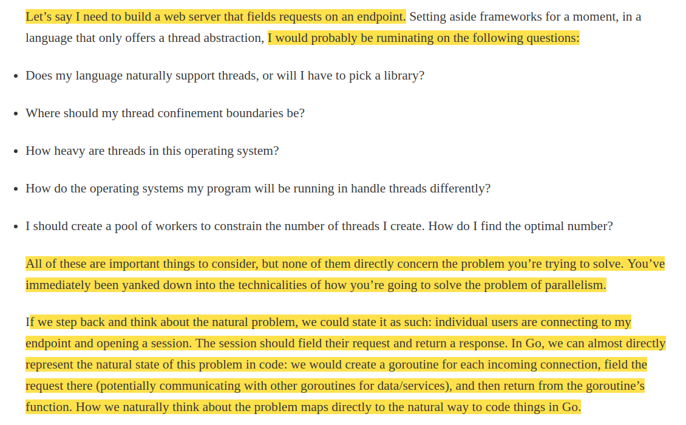
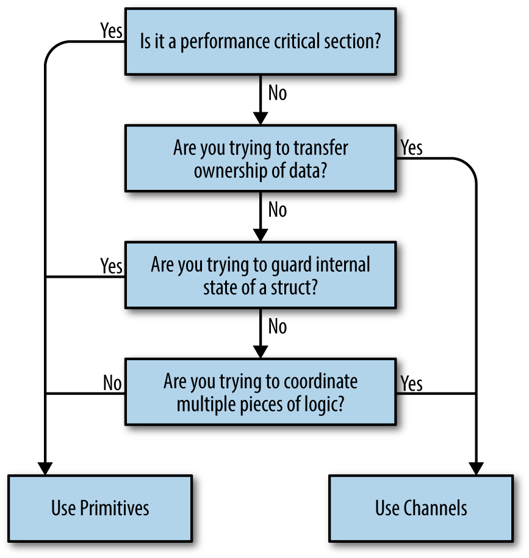

<h1 style="text-align: center;">
    B"H
</h1>


<h2 style="text-align: center;">
Concurrency in Go
</h2>


---

### URL's
- [O'Reilly Learning Book](https://learning.oreilly.com/library/view/concurrency-in-go/9781491941294/ch01.html)
- [Errata](https://www.oreilly.com/catalog/errata.csp?isbn=0636920046189)


---
<h2 style="text-align: center;">
Chapter 1. An Introduction to Concurrency
</h2>


#### Amdahl’s law
- Amdahl’s law describes a way in which to model the potential performance gains from implementing the solution to a problem in a parallel manner. 
- Simply put, it states that the gains are bounded by how much of the program must be written in a sequential manner.


---

#### Why Is Concurrency Hard?

1. **Race Conditions**

    - A race condition occurs when two or more operations must execute in the correct order, but the program has not been written so that this order is guaranteed.

    - Most of the time, data races are introduced because the developers are thinking about the problem sequentially. 

    - They assume that because a line of code falls before another that it will run first.

    - I sometimes find it helpful to imagine a large period of time passing between operations. Imagine an hour passes between the time when the goroutine is invoked, and when it is run. How would the rest of the program behave? 

    - Race conditions are one of the most insidious types of concurrency bugs because they may not show up until years after the code has been placed into production.

2. **Atomicity**
    - When something is considered atomic, this means that within the context that it is operating, it is indivisible, or uninterruptible.

    - The first thing that’s very important is the word “context.” Something may be atomic in one context, but not another.

    - Something that is atomic will happen in its entirety without anything happening in that context simultaneously.

    - Atomicity is important because if something is atomic, implicitly it is safe within concurrent contexts.

    - Most statements are **not** atomic, let alone functions, methods, and programs. 

    - We’ll go into more depth later, but in short we can force atomicity by employing various techniques.

3. **Memory Access Synchronization**

    - There’s a name for a section of your program that needs exclusive access to a shared resource. This is called a **critical section**.

4. **Deadlocks**    
    
    - A deadlocked program is one in which all concurrent processes are waiting on one another. 
    
    - In this state, the program will never recover without outside intervention.

    - The Go runtime attempts to do its part and will detect some deadlocks (all goroutines must be blocked, or “asleep”), but this doesn’t do much to help you prevent deadlocks.


    **Coffman Conditions**
    - There are a few conditions that must be present for deadlocks to arise. 

    - If we ensure that **at least one** of these conditions is not true, we can prevent deadlocks from occurring.
    
        **Mutual Exclusion**
        - A concurrent process holds exclusive rights to a resource at any one time.

        **Wait For Condition**
        - A concurrent process must simultaneously hold a resource and be waiting for an additional resource.

        **No Preemption**
        - A resource held by a concurrent process can only be released by that process, so it fulfills this condition.

        **Circular Wait**
        - A concurrent process (P1) must be waiting on a chain of other concurrent processes (P2), which are in turn waiting on it (P1), so it fulfills this final condition too.

        

5. **Livelocks**

    - Livelocks are programs that are actively performing concurrent operations, but these operations do nothing to move the state of the program forward.

    - Have you ever been in a hallway walking toward another person? She moves to one side to let you pass, but you’ve just done the same. So you move to the other side, but she’s also done the same. Imagine this going on forever, and you understand livelocks.        

    - In my opinion, livelocks are more difficult to spot than deadlocks simply because it can appear as if the program is doing work.

    - Livelocks are a subset of a larger set of problems called starvation. We’ll look at that next.

6. Starvation
    - Starvation is any situation where a concurrent process cannot get all the resources it needs to perform work.

    -  Livelocks warrant discussion separate from starvation because in a livelock, all the concurrent processes are starved equally, and no work is accomplished. More broadly, starvation usually implies that there are one or more greedy concurrent process that are unfairly preventing one or more concurrent processes from accomplishing work as efficiently as possible, or maybe at all.

    - One of the ways you can detect and solve starvation is by logging when work is accomplished, and then determining if your rate of work is as high as you expect it.

    - We should also consider the case where the starvation is coming from outside the Go process. Keep in mind that starvation can also apply to CPU, memory, file handles, database connections: any resource that must be shared is a candidate for starvation.

---

### Some Advice


---


---


---
<h2 style="text-align: center;">
Chapter 2. Modeling Your Code: Communicating Sequential Processes
</h2>


### The Difference Between Concurrency and Parallelism

Concurrency is a property of the code; parallelism is a property of the running program.

- We do not write parallel code, only concurrent code that we hope will be run in parallel. Parallelism is a property of the runtime of our program, not the code.

---
---


---

### CSP - Communicating Sequential Processes

In this paper, Hoare suggests that **input** and **output** are two overlooked primitives of programming-particularly in concurrent code.


---

Goroutines free us from having to think about our problem space in terms of parallelism and instead allow us to model problems closer to their natural level of concurrency.



- Go’s runtime multiplexes goroutines onto OS threads automatically and manages their scheduling for us. 

---


---


---




**Go’s philosophy on concurrency can be summed up like this: aim for simplicity, use channels when possible, and treat goroutines like a free resource.**


---
<h2 style="text-align: center;">
Chapter 3. Go’s Concurrency Building Blocks
</h2>


<h4 style="text-align: center; color:red">
Goroutines
</h4>


- Every Go program has at least one goroutine: the main goroutine, which is automatically created and started when the process begins.

-  A goroutine is a function that is running concurrently (remember: not necessarily in parallel!) alongside other code.

**Example 1.a:**
```go
func main() {
    go sayHello()
    // continue doing other things
}

func sayHello() {
    fmt.Println("hello")
}
```

**Example 1.b - same but using an *anonymous function:***
```go
go func() {
    fmt.Println("hello")
}()

// continue doing other things
```


**Example 1.c - same but assign the function to a variable:**
```go
sayHello := func() {
    fmt.Println("hello")
}

go sayHello()

// continue doing other things
```

---

**That's all folks to get started! What follows are some more behind-the-scenes details.**


---

**Goroutines with Closures**

Closures close around the lexical scope they are created in, thereby capturing variables.

```go
var wg sync.WaitGroup

salutation := "hello"

wg.Add(1)

go func() {
    defer wg.Done()
    salutation = "welcome" 
}()

wg.Wait()

fmt.Println(salutation)
```

- Goroutines execute within the same address space they were created in, and so our program prints out the word “welcome”

`OUTPUT: welcome`

---


---


---


---
---


---


- Actually even smaller now.

- On my laptop I have 8 GB of RAM, which means that in theory I can spin up **millions** of goroutines without requiring swapping.


---
<h4 style="text-align: center; color:red">
The sync Package
</h4>


<h5 style="text-align: center; color:purple">
sync.WaitGroup
</h5>

- `WaitGroup` is a great way to wait for a **set** of concurrent operations to complete when you either 
    - don’t care about the result of the concurrent operation, or 
    - you have other means of collecting their results. 
- If neither of those conditions are true, I suggest you use `channels` and a `select` statement instead.


---
<h5 style="text-align: center; color:purple">
sync.Mutex 
</h5>


```go
var count int
var lock sync.Mutex

increment := func() {
    lock.Lock()                 
    defer lock.Unlock()         
    count++
    fmt.Printf("Incrementing: %d\n", count)
}

decrement := func() {
    lock.Lock()                 
    defer lock.Unlock()         
    count--
    fmt.Printf("Decrementing: %d\n", count)
}

// Increment
var arithmetic sync.WaitGroup
for i := 0; i <= 5; i++ {
    arithmetic.Add(1)
    go func() {
        defer arithmetic.Done()
        increment()
    }()
}

// Decrement
for i := 0; i <= 5; i++ {
    arithmetic.Add(1)
    go func() {
        defer arithmetic.Done()
        decrement()
    }()
}

arithmetic.Wait()
fmt.Println("Arithmetic complete.")
```


---
<h5 style="text-align: center; color:purple">
sync.RWMutex
</h5>


---
<h5 style="text-align: center; color:purple">
sync.NewCond
</h5>

- A **`Cond`** is a rendezvous point for goroutines waiting for or announcing the occurrence of an event.
- An “event” is any arbitrary signal between two or more goroutines that carries no information other than the fact that it has occurred. 
- See book's repo for example code, if needed.


---
<h5 style="text-align: center; color:purple">
sync.Once
</h5>

As the name implies, `sync.Once` is a type that utilizes some sync primitives internally to ensure that only one call to `Do` ever calls the function passed in - even on different goroutines.
- See book's repo for example code, if needed.


---
<h5 style="text-align: center; color:purple">
sync.Pool
</h5>


- See book's repo for example code, if needed.


---
<h4 style="text-align: center; color:red">
Channels
</h4>


- While they can be used to synchronize access of the memory, **they are best used to communicate information between goroutines**. 

- Channels are extremely useful in programs of any size because of their ability to be composed together. 

- Like a river, a channel serves as a conduit for a stream of information; values may be passed along the channel, and then read out downstream. 

- For this reason I usually end my `chan` variable names with the word `Stream`. 

- The disparate parts of your program don’t require knowledge of each other, only a reference to the same place in memory where the channel resides. This can be done by passing references of channels around your program.

---

```go
// Declare channel:
var dataStream chan interface{} 

// Instantiate channel:
dataStream = make(chan interface{}) 
```

---


---


---

You can't write a value onto a read-only channel, read a value from a write-only channel. 
- You'll get an error at **compile time**.
- As we’ll see later in this section, this is a powerful way to make declarations about our API and to build composable, logical programs that are easy to reason about.

---

**Channels** are **blocking**:
- Any goroutine that attempts to write to a channel that is full will **wait** until the channel has been emptied.
- Any goroutine that attempts to read from a channel that is empty will **wait** until at least one item is placed on it.
- This can cause deadlocks if you don’t structure your program correctly. 

---

The receiving form of the `<-` operator can also optionally return two values.
 - The second return value is a way for a read operation to indicate whether the read off the channel was a value generated by a write elsewhere in the process, or a default value generated from a closed channel.

```go
stringStream := make(chan string)

go func() {
    stringStream <- "Hello channels!"
}()

salutation, ok := <-stringStream 1

fmt.Printf("(%v): %v", ok, salutation)

// OUTPUT: (true): Hello channels!
```

**Closed Channels**

- In programs, it’s very useful to be able to indicate that no more values will be sent over a channel. 
- This helps downstream processes know when to move on, exit, re-open communications on a new or different channel, etc. 
- To close a channel, we use the `close` keyword.

```go
intStream := make(chan int)
close(intStream)

integer, ok := <- intStream 

fmt.Printf("(%v): %v", ok, integer)
// OUTPUT: (false): 0
```

---


The `range` keyword - used in conjunction with the `for` statement - supports channels as arguments, and will automatically break the loop when a channel is closed.

```go
intStream := make(chan int)

go func() {
    
    // Ensure that the channel is closed before 
    // we exit the goroutine. 
    // This is a very common pattern.
    defer close(intStream) 
    
    for i := 1; i <= 5; i++ {
        intStream <- i
    }
}()

for integer := range intStream { 
    fmt.Printf("%v ", integer)
}

// OUTPUT: 1 2 3 4 5
```

---

Closing a channel is also one of the ways you can signal multiple goroutines simultaneously. 
- If you have `n` goroutines waiting on a single channel, instead of writing `n` times to the channel to unblock each goroutine, you can simply close the channel. 
- Since a closed channel can be read from an infinite number of times, it doesn’t matter how many goroutines are waiting on it, and closing the channel is both cheaper and faster than performing `n` writes.

```go
begin := make(chan interface{})

var wg sync.WaitGroup

for i := 0; i < 5; i++ {
    wg.Add(1)
    
    go func(i int) {
        defer wg.Done()

        // Pull from `begin` stream - BUT nothing
        // is in there, so it waits ... until 
        // `close(begin)` below "releases" it.
        <-begin 
        fmt.Printf("%v has begun\n", i)
    }(i)
}

fmt.Println("Unblocking goroutines...")
close(begin) 

wg.Wait()

/*
OUTPUT: 
Unblocking goroutines...
4 has begun
2 has begun
3 has begun
0 has begun
1 has begun
*/
```

- We discussed above using the `sync.Cond` type to perform the same behavior. 
- You can certainly use that, but as we’ve discussed, channels are composable, so this is my **favorite way** to unblock multiple goroutines at the same time.

---

#### Buffered Channels
- This means that even if no reads are performed on the channel, a goroutine can still perform `n` **writes**, where `n` is the capacity of the buffered channel. 


---

```go
var dataStream chan interface{}
dataStream = make(chan interface{}, 4) 
```
- We can place four things onto this channel regardless of whether it’s being read from.
- Notice how the declaration of a buffered channel is no different than an unbuffered one. 
    - This means that the goroutine that instantiates a channel controls whether it’s buffered. 
    - This suggests that the creation of a channel should probably be tightly coupled to goroutines that will be performing writes on it so that we can reason about its behavior and performance more easily. 
    - We’ll come back to this later in this section.

--- 

Unbuffered channels are also defined in terms of buffered channels: an unbuffered channel is simply a buffered channel created with a capacity of `0`.

Remember that when we discussed blocking, we said that writes to a channel block if a channel is full, and reads from a channel block if the channel is empty? 
- “Full” and “empty” are functions of the **capacity, or buffer size**. 
- An **unbuffered** channel has a capacity of zero and so it’s already full before any writes. 
- A **buffered** channel with no receivers and a capacity of four would be full after four writes, and block on the fifth write since it has nowhere else to place the fifth element. 
- In this way, buffered channels are an in-memory FIFO queue for concurrent processes to communicate over.


---

It also bears mentioning that if a buffered channel is empty and has a receiver, **the buffer will be bypassed and the value will be passed directly from the sender to the receiver**. 

---

Buffered channels can be useful in certain situations, **but you should create them with care**. 
- As we’ll see in the next chapter, buffered channels can easily become a **premature optimization** and also **hide deadlocks** by making them more unlikely to happen. 
- You’d much rather find a deadlock while writing code the first time, and not in the middle of the night when your production system goes down.
- They can be useful under the right conditions: if a goroutine making writes to a channel has knowledge of how many writes it will make, it can be useful to create a buffered channel whose capacity is the number of writes to be made, and then make those writes as quickly as possible. 
    - There are, of course, caveats, and we’ll cover them in the next chapter.

---

Let’s examine another, more complete code example that uses buffered channels.
- If you look at the output, you can see how our anonymous goroutine is able to place all five of its results on the `intStream` buffered channel and exit before the main goroutine pulls even one result off.

```go

// -- -------------------------------------
// Cool! 
// Create an in-memory buffer to help mitigate
// the nondeterministic nature of the output. 
// It doesn’t give us any guarantees, but it’s 
// a little faster than writing to stdout directly.
var stdoutBuff bytes.Buffer

// Ensure that the buffer is written out to 
// stdout before the process exits.
defer stdoutBuff.WriteTo(os.Stdout)
// -- -------------------------------------


intStream := make(chan int, 4)

go func() {
	defer close(intStream)
	defer fmt.Fprintln(&stdoutBuff, "Producer Done.")

    for i := 0; i < 5; i++ {
		fmt.Fprintf(&stdoutBuff, "Sending: %d\n", i)
		intStream <- i
	}
}()

for integer := range intStream {
	fmt.Fprintf(&stdoutBuff, "Received %v.\n", integer)
}

/*
OUTPUT
--------------
Sending: 0
Sending: 1
Sending: 2
Sending: 3
Sending: 4
Producer Done.
Received 0.
Received 1.
Received 2.
Received 3.
Received 4.
*/
```